# Full Interpretation

#### Full interpretation of minimal images – Detailed human identification of object parts
The goal in this work is to model the human vision process of ‘full interpretation’ of object images, 
which is the ability to identify and localize all semantic features and parts that are 
recognized by human observers. 
The task is approached by dividing the interpretation of the 
complete object to the interpretation of multiple reduced but interpretable local regions. 
In such reduced regions, interpretation is simpler, since the number of semantic components is small, 
and the variability of possible configurations is low.

We model the interpretation process by identifying primitive components and relations 
that play a useful role in local interpretation by humans. 
To identify useful components and relations used in the interpretation process, 
we consider the interpretation of ‘minimal configurations’: 
these are reduced local regions, which are minimal in the sense that further reduction 
renders them unrecognizable and uninterpretable. 
We show that such minimal interpretable images have useful properties, 
which we use to identify informative features and relations used for full interpretation. 
We describe our interpretation model, 
and show results of detailed interpretations of minimal configurations, 
produced automatically by the model. 
Finally, we discuss possible extensions and implications of full interpretation to 
difficult visual tasks, such as recognizing social interactions, 
which are beyond the scope of current models of visual recognition.
The complete details for this study are in this [paper](https://ge.box.com/s/5h3p6wk34jhstqkav5fbhglmovdpru6i).

#### Requirements
* pytorch 1.1 or more
* sklearn
* scikit-image
* tqdm
* tensorboard
* sacred

#### Data
##### Raw matlab data:
The folder [raw_data](https://www.dropbox.com/sh/faktmyhspckyjbj/AAB-xPG_dVJKWScWDaAr6WaNa?dl=0) contains minimal image examples and their human full interpretation data (referred below as annotations). 
The raw annotations for each minimal image category are stored in a MAT file, which contains both the minimal images and the human 'full interpretation' for it.
More details are in this [page](raw_data/raw_data_python.md).

##### Preprocessed contour data, ready for python experiments:
Download this [tar file](https://ge.box.com/s/l7v9iiwgag0hv9nxh9oblblgtbiftbfr)
 (~80M size) and extract it into your `data/` folder. Update DATA_DIR in your `CONSTS.py` accordingly.
 The folder contains both images and contour annotation maps. A summary of the data follows:  

| Class index   | Minimal Image Type | Pixel Size | # annotated images  | Examples  | Hard negative examples |
|:-------------:|:------------------:|:----------:|:---------:| --------- | -----------------------
| 1             | Man-In-Suit        |   *21x21*  |   *439*   |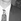, 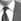, 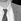       |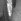, 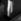, 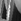       |
| 2             | Human-Eye          |   *20x20*  |   *234*   |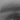, 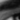, 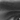       |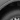, 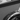, 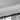       |
| 3             | Bike               |   *30x30*  |   *229*   |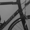, ,        |
| 4             | Horse-Head         |   *30x30*  |   *604*   |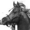, 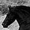, 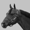       |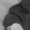, , 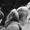       |
| 0             | none of the above  |   *30x30*  |   *Inf*   |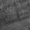, 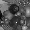, 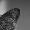          |

This data file also includes **hard negative** examples, which are visually similar to the minimal images. 
To add more **negative** examples, you can use the random crop procedure described in the next section.  
 
##### Random crop for non-class examples at minimal image style
In your `data/` folder, create a new folder `nonfour`, with sub-folders `nonfour/train` and `nonfour/test`. 
Then run
#TODO Fix the sliding mode
```bash
python randomCrop.py -i data/imgs/nonfour_samples/train -o data/nonfour/train
python randomCrop.py -i data/imgs/nonfour_samples/test -o data/nonfour/test
```
To use selective search mode (recommended over sliding window) clone this repo:
```bash
git clone https://github.com/ChenjieXu/selective_search.git
```

Run the script with more parameters, e.g., 
```bash
python randomCrop.py -i data/imgs/nonfour_samples/train/ -o data/nonfour -ns 10 -lm 400
```

To use files from VOC dataset, e.g.,
```bash
python randomCrop.py -i voc_horse -o /shared-data5/guy/data/minimal/negatives/nonhorseL -ns 1 -lm 100000000
```

#### Full interpretation models
##### Original matlab-based model:
TBD

#### Papers
If you use the code or data in this repo please cite the following 
[paper](https://www.researchgate.net/publication/320921911_Full_interpretation_of_minimal_images):    

@article{fullinterpretation,   
  title={Full interpretation of minimal images},    
  author={Ben-Yosef, Guy and Assif, Liav and Ullman, Shimon},   
  journal={Cognition},  
  volume={171},  
  pages={65--84},       
  year={2018},  
  publisher={Elsevier}  

Other relevant papers include: 
* G. Ben-Yosef, L. Assif, D. Harari, and S. Ullman, A model for full local image interpretation, in the Proceedings of the 37th Annual Meeting of the Cognitive Science Society, 2015.
* S. Ullman, L. Assif, E. Fetaya, D. Harari, Atoms of recognition in human and computer vision, in Proceedings of the National Academy of Sciences, 2016. 113, 2016.
* G. Ben-Yosef, L. Assif, and S. Ullman, Structured learning and detailed interpretation of minimal object images. In Workshop on Mutual Benefits of Cognitive and Computer Vision, the International Conference on Computer Vision, 2017.
* G. Ben-Yosef, A. Yachin, and S. Ullman, A model for interpreting social interactions in local image regions in AAAI spring symposium on Science of Intelligence: Computational Principles of Natural and Artificial Intelligence, 2017.
* G. Ben-Yosef and S. Ullman, Image interpretation above and below the object level. Journal of The Royal Society Interface Focus, 8(4), 20180020, 2018.
* S. Srivastava, G. Ben-Yosef*, X. Boix*, Minimal images in deep neural networks: Fragile Object Recognition in Natural Images. International Conference on Learning Representations, 2019. (* equal contribution)

#### Minimal Videos repo
Related work on interpretation and action recognition in minimal video configurations is in 
this [github repo](https://github.com/guybenyosef/introducing_minimal_videos).
